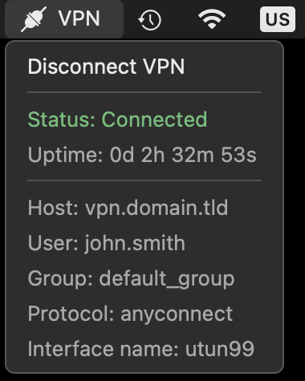
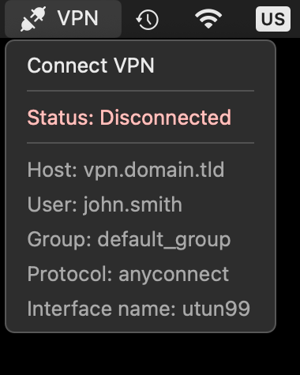

# openconnect-menu-bar
SwiftBar/xbar plugin to establish VPN connections via OpenConnect and monitor connection status


## Credit

- For original concept and initial work to: [Jesse Jarzynka](https://github.com/jessejoe) ([file link](https://github.com/matryer/xbar-plugins/blob/7afadc2d29270c47fe09df4cabc8c29206bd419d/Network/vpn_advanced.sh))
- For modifications and improvement work to: [Ventz Petkov](https://github.com/ventz) ([repo link](https://github.com/ventz/openconnect-gui-menu-bar))
  - This script is based on the 2023-11-08 version of Ventz' BitBar plugin script available [here](https://github.com/ventz/openconnect-gui-menu-bar/blob/6bda0e18b12493b5c727f6cfca636e1455f23d56/openconnect.sh).
- For the original vpnc-script to:
  - © 2005-2012 Maurice Massar, Jörg Mayer, Antonio Borneo et al.
  - © 2009-2022 David Woodhouse ([email](dwmw2@infradead.org)), Daniel Lenski ([email](dlenski@gmail.com)) et al.
- For the menu bar icons to: [FreeImages.com](https://www.freeimages.com)/VisualPharm
  - Usage of the content in a project such as this is permitted according to the FreeImages [license](https://www.freeimages.com/license) (May 2022 version)
  - Disconnected icon: https://www.freeimages.com/icon/disconnected-5668900
  - Connected icon: https://www.freeimages.com/icon/connected-5669666


## Purpose

This script provides a convenient way to control and monitor the OpenConnect VPN connection status from the macOS menu bar using either of these two apps:
- [SwiftBar (recommended)](https://github.com/swiftbar/SwiftBar)
- [xbar](https://xbarapp.com/)


## Screenshots






## Setup

### 1. Install the latest SwiftBar or xbar release

- [SwiftBar (recommended)](https://github.com/swiftbar/SwiftBar)
- [xbar](https://xbarapp.com/)


### 2. Install OpenConnect by a method of your choice

E.g. with the [homebrew package manager](https://brew.sh):
```shell
brew install openconnect
```


### 3. Test out the OpenConnect installation manually

Check to see if OpenConnect works out of the box with the provided [vpnc-script](https://www.infradead.org/openconnect/vpnc-script.html):
(Change the URL to your own VPN host and also change connection parameters if needed - see [here](https://www.infradead.org/openconnect/connecting.html))
```shell
sudo openconnect https://vpn.example.tld
```
If there are errors such as "... is not a recognized network service", see the README in the `vpnc-script/` folder of this repo.


### 4. Download the "openconnect.15s.sh" script and follow the steps inside to customize

1. [Download](https://github.com/niklasbogensperger/openconnect-menu-bar/blob/main/openconnect.15s.sh) the file
2. Open it in a plain text editor or IDE of your choice
3. Follow all steps in the "CONFIGURATION STEPS" section
4. Copy/Move it to the SwiftBar/xbar script folder that you or the app chose
5. Make sure the file is executable: `chmod +x openconnect.15s.sh`


### 5. Miscellaneous tips and tricks

- Hold the <kbd>⌥ Option</kbd> key while clicking on the menu bar entry to bring up SwiftBar options that are hidden by default (only applies to SwiftBar)
- Hold the <kbd>⌘ Command</kbd> key to drag the menu bar entry to the desired spot